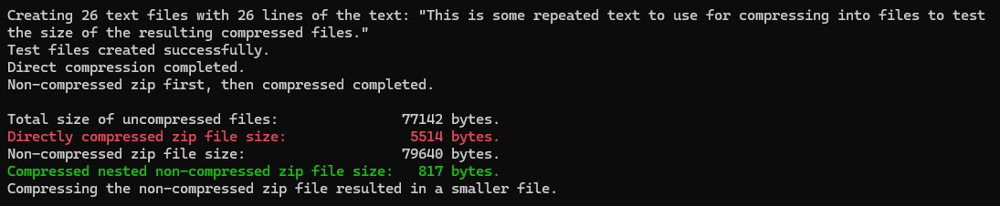

# Nested Zip Playground  

This is an experiment to see if uncompressed zip files containing mostly redundant data then nested inside a compressed zip file can result in smaller file sizes than zip files zipped the traditional way.

This experiment is based on the understanding that zip files compress files, then append the compressed files to the zip file so each file can be accessed at random. Files are not generally compressed into the other files in the zip archive. With this understanding, it seemed likely that zipping an uncompressed zip file ought to result in a smaller size than a regularly compressed zip file; provided there are multiple files, the data is mostly redundent, and the difference is larger than the zip header information. The nested zip file is uncompressed to maximize the possibility of redundant data from the origional files. Compressed nested inner zip files would be more likely to result in differnt date for each file inside.  

